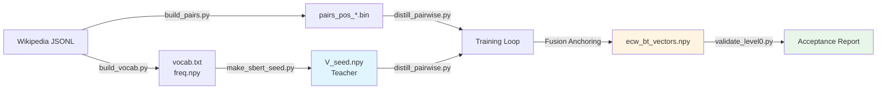

# ECW-BT Level-0: SBERT-Seeded Word Embeddings

Production-grade word vector training pipeline that:
- Seeds from SBERT geometry (teacher, immutable)
- Learns Wikipedia co-occurrence via CCD physics
- Prevents collapse and catastrophic forgetting via fusion anchoring
- Optimized for Apple Silicon (MPS) with pre-generated negatives

> **What this is NOT**: This is not a neural language model or a transformer replacement. ECW-BT produces word-level geometry that higher-level systems (Nova/Livnium) compose and reason over.

## Design Philosophy

- **Geometry first, labels second**: Word vectors encode spatial relationships, not task-specific signals
- **Teacher provides structure, student provides adaptation**: SBERT seed anchors semantics; CCD physics adapts to co-occurrence
- **Stability > peak benchmark score**: Fusion anchoring prevents catastrophic forgetting; acceptance criteria ensure reproducibility

## Architecture



**Pipeline Flow:**
1. **Phase 0**: Create SBERT seed (`V_seed.npy`) - teacher geometry, immutable
2. **Phase 1**: Build vocab and co-occurrence pairs from Wikipedia
3. **Phase 2**: Train student vectors with CCD physics + fusion anchoring
4. **Phase 3**: Validate acceptance criteria (drift, collapse, neighbors)

## Quick Start

### Full Pipeline (First Time)

```bash
cd nova/ecw-BT

# 1. Clean start (optional but recommended)
./clean_start.sh

# 2. Build vocab and frequency table
python scripts/build_vocab.py \
  --wiki-paths wikipedia/wiki_extractor_src/extracted/AA/wiki_00 \
  --out-dir data \
  --max-vocab 50000 \
  --write-mass-table

# 3. Build positive pair shards
python scripts/build_pairs.py \
  --wiki-paths wikipedia/wiki_extractor_src/extracted/AA/wiki_00 \
  --vocab data/vocab.txt \
  --out-dir data/pairs \
  --window 5 \
  --pairs-per-shard 5000000 \
  --symmetric

# 4. Create SBERT seed (teacher vectors)
python scripts/make_sbert_seed.py \
  --vocab data/vocab.txt \
  --output data/V_seed.npy \
  --dim 256 \
  --model sentence-transformers/all-mpnet-base-v2

# 5. Train with CCD + fusion
export PYTORCH_MPS_HIGH_WATERMARK_RATIO=0.0
export PYTORCH_ENABLE_MPS_FALLBACK=1

python scripts/distill_pairwise.py \
  --seed data/V_seed.npy \
  --pairs data/pairs/pairs_pos_*.bin \
  --vocab data/vocab.txt \
  --freq data/freq.npy \
  --output data/ecw_bt_vectors.npy \
  --dim 256 \
  --lr 1e-3 \
  --negatives 5 \
  --epochs 3 \
  --device mps \
  --pairs-per-step 1000000

# 6. Validate acceptance
python scripts/validate_level0.py \
  --checkpoint data/ecw_bt_vectors.npy \
  --seed data/V_seed.npy \
  --mass-table data/mass_table.json \
  --vocab data/vocab.txt
```

### Quick Test (Small Vocab)

```bash
# Smaller vocab for faster testing
python scripts/build_vocab.py --wiki-paths wikipedia/... --out-dir data --max-vocab 10000 --write-mass-table
python scripts/build_pairs.py --wiki-paths wikipedia/... --vocab data/vocab.txt --out-dir data/pairs --window 5
python scripts/make_sbert_seed.py --vocab data/vocab.txt --output data/V_seed.npy --dim 256
python scripts/distill_pairwise.py --seed data/V_seed.npy --pairs data/pairs/pairs_pos_*.bin --vocab data/vocab.txt --freq data/freq.npy --output data/ecw_bt_vectors.npy --dim 256 --epochs 1 --pairs-per-step 500000
```

## Scripts Overview

| Script | Purpose | Phase | Input | Output |
|--------|---------|-------|-------|--------|
| `scripts/build_vocab.py` | Build vocabulary | 1A | Wikipedia JSONL | `vocab.txt`, `freq.npy` |
| `scripts/build_pairs.py` | Extract co-occurrence pairs | 1B | `vocab.txt`, Wikipedia | `pairs_pos_*.bin` |
| `scripts/make_sbert_seed.py` | Create teacher vectors | 0 | `vocab.txt` | `V_seed.npy` |
| `scripts/distill_pairwise.py` | Train with CCD + fusion | 2 | pairs, seed | `ecw_bt_vectors.npy` |
| `scripts/validate_level0.py` | Acceptance testing | 3 | vectors, seed | `validate_level0.log` |
| `tools/probe_galaxy.py` | Interactive probing | - | checkpoint | neighbors, sentences |
| `tools/analogy_test.py` | Analogy evaluation | - | checkpoint | accuracy report |
| `tools/visualize_galaxy.py` | UMAP visualization | - | checkpoint | `galaxy_map_hd.html` |
| `clean_start.sh` | Clean cache/prep | - | - | cleaned workspace |

## Core Concepts

### SBERT Seed (Teacher)
- Immutable geometry from `sentence-transformers/all-mpnet-base-v2`
- Projected to target dimension (default: 256)
- Provides semantic structure that student learns to deform

### CCD Physics
- **Divergence pivot**: `align_barrier = 0.38` (cosine similarity threshold)
- **Positives**: Pull together (attraction toward barrier)
- **Negatives**: Push apart (repulsion when above barrier)
- **Force shaping**: Bounded via `tanh` or `clip` to prevent explosions

### Fusion Anchoring
- Prevents catastrophic forgetting: `V_student = λ·V_student + (1-λ)·V_seed`
- Lambda schedule: epoch1=0.05, epoch2=0.10, epoch3+=0.15
- Teacher acts as elastic scaffold

### Pre-generated Negatives
- Negatives sampled once per shard (not per batch)
- Eliminates CPU→GPU transfers in hot loop
- Chunked processing (200k pairs) to avoid OOM

## Performance

### Expected Throughput
- **~100-150k pairs/sec** on Apple Silicon (MPS)
- **Memory**: ~2-3GB for 50k vocab × 256 dim
- **Pre-generation**: ~1-2s per shard (one-time cost)
- **Training**: ~8-10s per 1M pair batch

### Known Limitations
- **MPS OOM**: With >1M pairs × 5 negatives, chunking handles this automatically
- **Auto-optimize**: Disabled by default (reducing batch size hurts performance)
- **Large vocab**: >200k vocab may need `--pairs-per-step` reduction
- **CPU fallback**: Use `--device cpu` if MPS crashes persist

### Optimization Tips
- Use `--pairs-per-step 1000000` or higher (fewer scatters = faster)
- Pre-generation overhead is one-time per shard (worth it)
- Disable `--auto-optimize` (it reduces batch size and hurts performance)
- For testing: use `--negatives 3` and smaller vocab

## Probing and Evaluation

### Interactive Probing
```bash
python tools/probe_galaxy.py \
  --checkpoint data/ecw_bt_vectors.npy \
  --mass data/mass_table.json \
  --query kitten \
  --topk 15

python tools/probe_galaxy.py \
  --checkpoint data/ecw_bt_vectors.npy \
  --mass data/mass_table.json \
  --sentence "a small cat chased a mouse" \
  --topk 15 \
  --resonance 0.5
```

### Analogy Testing
```bash
python tools/analogy_test.py \
  --checkpoint data/ecw_bt_vectors.npy \
  --mass-table data/mass_table.json
```

### Visualization
```bash
python tools/visualize_galaxy.py \
  --checkpoint data/ecw_bt_vectors.npy \
  --mass data/mass_table.json \
  --limit 10000
# Opens tools/galaxy_map_hd.html in browser
```

## Legacy Scripts

These scripts are kept for reference but are not part of the main Level-0 pipeline (located in `legacy/`):

- **`legacy/train_ecw_bt.py`**: Old window-based trainer (streaming windows, no SBERT seed)
- **`legacy/inject_sbert_pairwise.py`**: Post-processing SBERT injection (refines existing vectors)
- **`legacy/distill_rotate.py`**: Procrustes rotation alignment (whitening + rotation to SBERT space)
- **`legacy/apply_rotated_vectors.py`**: Apply rotation transforms

## File Structure

```
nova/ecw-BT/
├── scripts/                   # Level-0 pipeline scripts
│   ├── build_vocab.py         # Phase 1A: Build vocab
│   ├── build_pairs.py          # Phase 1B: Build pairs
│   ├── make_sbert_seed.py     # Phase 0: Create seed
│   ├── distill_pairwise.py    # Phase 2: Main trainer
│   └── validate_level0.py     # Phase 3: Validation
├── tools/                      # Utility scripts
│   ├── probe_galaxy.py        # Interactive probing
│   ├── analogy_test.py        # Analogy evaluation
│   ├── visualize_galaxy.py    # UMAP visualization
│   └── galaxy_map_hd.html     # Visualization output
├── legacy/                     # Legacy/experimental scripts
│   ├── train_ecw_bt.py        # Old window-based trainer
│   ├── inject_sbert_pairwise.py
│   ├── distill_rotate.py
│   └── apply_rotated_vectors.py
├── src/                        # Core modules
│   ├── config.py              # Configuration
│   ├── physics.py             # Force laws
│   ├── data_loader.py          # Data streaming
│   ├── trainer.py             # Legacy trainer
│   └── collapse_engine.py     # Gravity pooling
├── data/                       # Data artifacts
│   ├── vocab.txt              # Vocabulary (id → token)
│   ├── freq.npy               # Token frequencies
│   ├── mass_table.json        # Legacy format (word → freq/mass)
│   ├── V_seed.npy             # SBERT seed vectors (teacher)
│   ├── ecw_bt_vectors.npy     # Final trained vectors
│   └── pairs/                 # Pair shards
│       ├── pairs_pos_*.bin    # Pair shards (int32 binary)
│       └── pairs_meta.json    # Pair metadata
├── checkpoints/                # Training checkpoints
├── logs/                       # Training logs
├── wikipedia/                  # Raw Wikipedia data
├── clean_start.sh              # Clean cache script
├── requirements-ecw-bt.txt     # Python dependencies
├── README.md                   # This file
└── PLAN.md                     # Original plan (historical)
```

## Acceptance Criteria

After training, vectors should pass `validate_level0.py`:

- **Teacher drift**: Mean cosine similarity >0.5 (retains SBERT structure)
- **No collapse**: Random pair cosine <0.8 (vectors don't all point same direction)
- **Sane neighbors**: Nearest neighbors are semantically related
- **Analogy sanity**: Common analogies improve over random and SBERT baseline (not expected to match Word2Vec benchmarks)

> 🚫 **FREEZE RULE**: Once `validate_level0.py` passes, **DO NOT retrain or fine-tune these vectors**. Level-0 becomes immutable infrastructure for higher-level systems. Treat it as a frozen artifact, not a tunable model.

## Troubleshooting

### MPS Crashes
```bash
export PYTORCH_MPS_HIGH_WATERMARK_RATIO=0.0
export PYTORCH_ENABLE_MPS_FALLBACK=1
# Or use --device cpu
```

### Slow Training
- Increase `--pairs-per-step` (default: 1M)
- Reduce `--negatives` (default: 5, try 3)
- Disable `--auto-optimize` (it's disabled by default)
- Check system load: `--cpu-threads 2 --throttle 0.01` if needed

### OOM Errors
- Reduce `--pairs-per-step` to 500000
- Reduce `--negatives` to 3
- Use `--device cpu` (slower but more stable)

### Validation Fails
- Check teacher drift (should be gradual, not cliff)
- Increase fusion lambda if drift too high
- Check for collapse (all vectors pointing same direction)
- Verify negatives are working (increase `--negatives`)

## References

- **CCD Physics**: Divergence-based force law with barrier at 0.38
- **Fusion Anchoring**: Elastic scaffold prevents catastrophic forgetting
- **SBERT**: `sentence-transformers/all-mpnet-base-v2` (768-dim → projected to target)
- **Word2Vec-style negatives**: Frequency-based sampling (freq^0.75)
